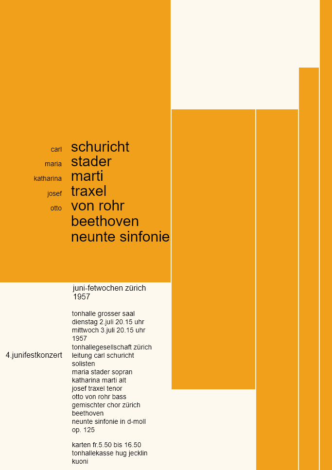

# Daily Layout No.03
*Web adaptation of a concert ad by Josef Müller-Brockmann*

[Click here to see the page](https://tricktrap.mx/labs/daily-layout-03/)

This is the third entry of Daily Layout, this time I tried to make a layout focused on vertical content.

In this particular example I was able to experiment with:

+ CSS Grid, minmax, fraction units
+ min-content and max-content
+ white-space property
+ Flex containters inside CSS grid.

### Here is a copy of the original version I use for reference:

### The web version, flexible and responsive:

I didn't use any media queries on this one.

**Feel free to play around with it**

Don't forget to checkout my other repositories for more examples.

### Thank you!
